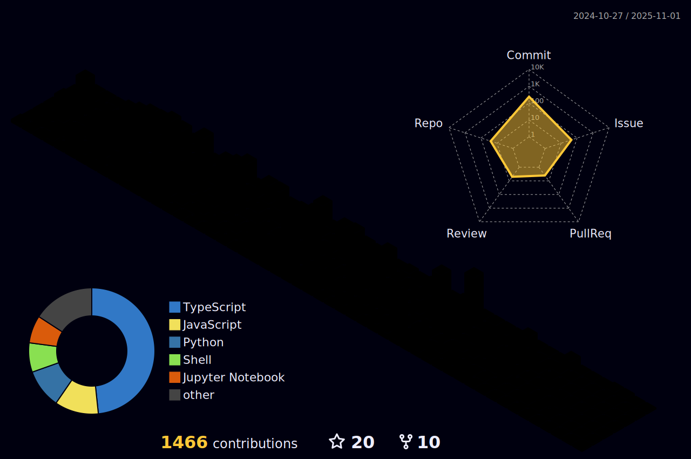

<!-- Programmer gif -->

  <ul align="left" style="list-style: none">
    

      <h1>
        👋 Hi, my name is Tibebe Solomon
      </h1>
    

  </ul>

  

**<h3 align="left">Connect with me:</h3>** 

  

 **<h3 align="left">Skills</h3>**

                     

 
                

 **<h3 align="left"> 📊  GitHub Stats</h3>**

  
  

  

